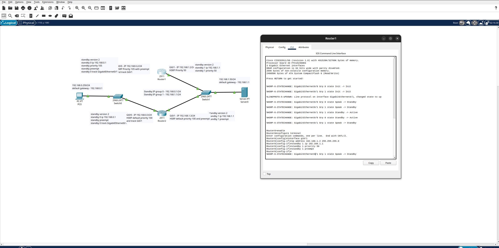
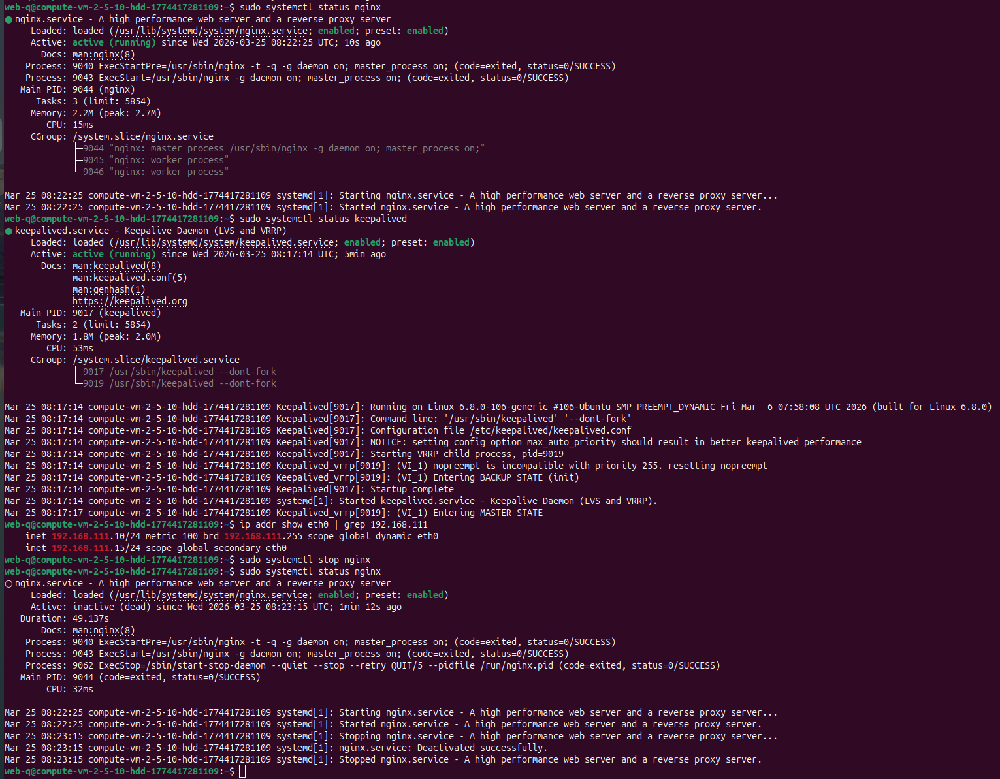
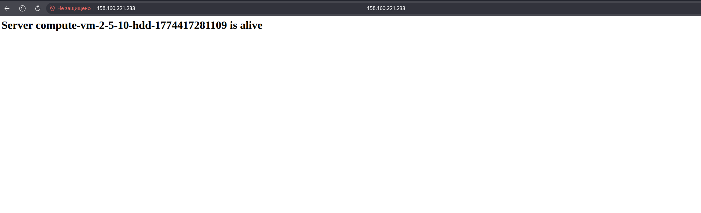

# Домашнее задание к занятию 1 «Disaster recovery и Keepalived»
**Выполнил:** Чехлов Михаил


## Задание 1

### Настройки router


*Cisco packet tracer.*


## Задание 2

### Статус веб-серверов 


*Статус раннера — active (зелёная точка), теги: `nginx`, `keepalived`.*

### Веб-страница с запущенным сервером 


*compute-vm-2-5-10-hdd-1774417281109 (VM-1).*

### Веб-страница с запущенным сервером и переадресацией с плавающим IP-адресом.


*compute-vm-2-5-10-hdd-1774417411166 (VM-2).*

## Создание Bash‑скрипта проверки

Содержимое файла `/usr/local/bin/check_webserver.sh`:

```sh

# Конфигурация
WEB_PORT=80
WEB_ROOT="/var/www/html"
INDEX_FILE="index.html"

# Проверка существования файла index.html
if [ ! -f "${WEB_ROOT}/${INDEX_FILE}" ]; then
    echo "ERROR: File ${INDEX_FILE} not found in ${WEB_ROOT}"
    exit 1
fi

# Проверка доступности порта веб‑сервера
if ! nc -z -w 3 localhost ${WEB_PORT}; then
    echo "ERROR: Web server port ${WEB_PORT} is not accessible"
    exit 1
fi

# Если всё в порядке
echo "OK: Web server and index.html are available"
exit 0
```
## Настройка VIP в Keepalived

Содержимое файла `/etc/keepalived/keepalived.conf`:

VM1 (MASTER):
```conf
vrrp_instance VI_1 {
    state BACKUP
    interface eth0
    virtual_router_id 15
    priority 255
    nopreempt

    virtual_ipaddress {
        192.168.111.15/24 dev eth0
    }
}

```
VM2 (BACKUP):
```conf
vrrp_instance VI_1 {
    state BACKUP
    interface eth0
    virtual_router_id 15
    priority 100
    nopreempt

    virtual_ipaddress {
        192.168.111.15/24 dev eth0
    }
}

